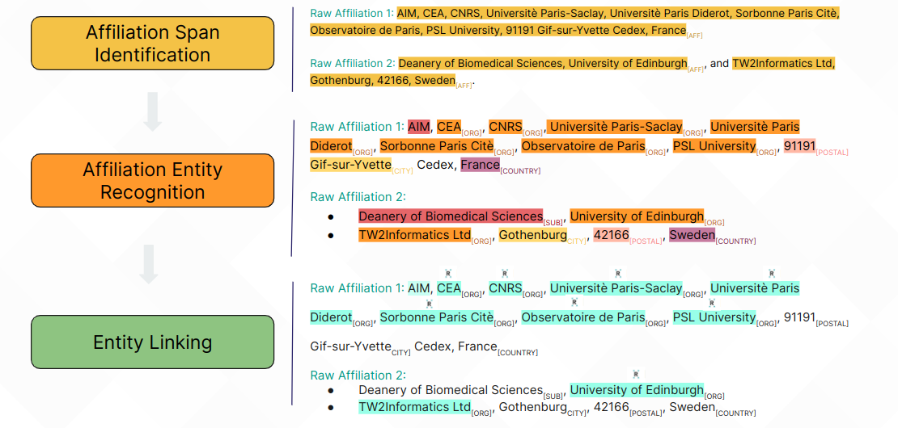

# AffilGood 🕺🏿

AffilGood provides annotated datasets and tools to improve the accuracy of attributing scientific works to research organizations, especially in multilingual and complex contexts. The accurate attribution of scientific works to research organizations is hindered by the lack of openly available manually annotated data--in particular when multilingual and complex affiliation strings are considered. The AffilGood framework introduced in this paper addresses this gap. We identify three sub-tasks relevant for institution name disambiguation and make available annotated datasets and tools aimed at each of them, including i) a dataset annotated with affiliation spans in noisy automatically-extracted strings; ii) a dataset annotated with named entities for the identification of organizations and their locations; iii) seven datasets annotated with ROR identifiers for the evaluation of entity-linking systems. In addition, we describe, evaluate and make available newly developed tools that use these datasets to provide solutions for each of the identified sub-tasks. Our results confirm the value of the developed resources and methods in addressing key challenges in institution name disambiguation.

This is the official repository for the paper ["AffilGood: Building reliable institution name disambiguation tools to improve scientific literature analysis"](https://aclanthology.org/2024.sdp-1.13/), published in the Scholarly Document Processing (SDP) 2024 Workshop at ACL 2024 Conference. Slides used in the presentation are available [here](https://docs.google.com/presentation/d/1wX7zInjoUrjO1hRL3U8tpSzxU6KOX0FknTaEqSf6ML0/edit#slide=id.g2effd47279e_0_22).



## 📝 Results
### Pipeline
Pipeline (NER+EL) results, evaluated by example-based F1-score. AffilGood-NER-multilingual correspond to the best-performing fine-tuned NER model with adapted XLM-RoBERTa, and AffilGood-NER, to the best with adapted English RoBERTa. Entities in pre-segmented datasets have concatenated with coma-separator.  

| **Model**                     | **MA** | **FA** | **NRMO** | **S2AFF*** | **CORDIS** | **ETERe** | **ETERm** |
|-------------------------------|--------|--------|----------|------------|------------|-----------|-----------|
| ElasticSearch                 | .545   | .407   | .470     | .515       | .751       | .855      | .847      |
| OpenAlex                      | .394   | .118   | .769     | **.871**🔥  | .648       | .859      | .852      |
| S2AFF                         | .546   | .367   | .617     | .785       | .649       | .668      | .720      |
| AffRo                         | .452   | .408   | .558     | .726       | .641       | .709      | .617      |
| AffilGoodNERm + S2AFF<sub>Linker</sub> | .596 | .685 | .762 | .841       | .827       | .887      | .863      |
| AffilGoodNER + S2AFF<sub>Linker</sub>  | .579 | .685 | .758 | .850       | .839       | .895      | .855      |
| AffilGoodNERm + Elastic       | .690   | .587   | .747     | .640       | .849       | .887      | .894      |
| AffilGoodNER + Elastic        | .649   | .610   | .755     | .648       | .855       | .893      | .881      |
| AffilGoodNERm + Elastic+qLLM  | **.710**🔥 | .721 | **.774**🔥 | .790 | .881       | **.936**🔥 | **.916**🔥 |
| AffilGoodNER + Elastic+qLLM   | .653   | **.747**🔥 | .767 | .799       | **.891**🔥 | **.936**🔥 | .909      |

Disclaimer: we cannot guarantee that any of the baseline systems, such as OpenAlex or S2AFF, used samples from the original version of the S2AFF dataset for training, since it is open.

## 📣 Citation
```
@inproceedings{duran-silva-etal-2024-affilgood,
    title = "{A}ffil{G}ood: Building reliable institution name disambiguation tools to improve scientific literature analysis",
    author = "Duran-Silva, Nicolau  and
      Accuosto, Pablo  and
      Przyby{\l}a, Piotr  and
      Saggion, Horacio",
    editor = "Ghosal, Tirthankar  and
      Singh, Amanpreet  and
      Waard, Anita  and
      Mayr, Philipp  and
      Naik, Aakanksha  and
      Weller, Orion  and
      Lee, Yoonjoo  and
      Shen, Shannon  and
      Qin, Yanxia",
    booktitle = "Proceedings of the Fourth Workshop on Scholarly Document Processing (SDP 2024)",
    month = aug,
    year = "2024",
    address = "Bangkok, Thailand",
    publisher = "Association for Computational Linguistics",
    url = "https://aclanthology.org/2024.sdp-1.13",
    pages = "135--144",
    abstract = "The accurate attribution of scientific works to research organizations is hindered by the lack of openly available manually annotated data{--}in particular when multilingual and complex affiliation strings are considered. The AffilGood framework introduced in this paper addresses this gap. We identify three sub-tasks relevant for institution name disambiguation and make available annotated datasets and tools aimed at each of them, including i) a dataset annotated with affiliation spans in noisy automatically-extracted strings; ii) a dataset annotated with named entities for the identification of organizations and their locations; iii) seven datasets annotated with the Research Organization Registry (ROR) identifiers for the evaluation of entity-linking systems. In addition, we describe, evaluate and make available newly developed tools that use these datasets to provide solutions for each of the identified sub-tasks. Our results confirm the value of the developed resources and methods in addressing key challenges in institution name disambiguation.",
}
```

## Project Structure

The repository is structured as follows:

```
affilgood/
├── AffilGoodNER/
│   ├── config.py
│   ├── functions.py
│   └── ner.py
├── AffilGoodSpan/
│   ├── config.py
│   ├── span.py
│   └── functions.py
├── AffilGoodEL/
│   ├── s2aff_el.py
│   ├── config.py
│   ├── functions.py
│   ├── download_s2aff.py
│   └── S2AFF/
├── data/
│   ├── input_span/
│   ├── output_el/
│   ├── output_ner/
│   └── output_span/
├── utils/
│   ├── config.py
│   └── functions.py
└── run_pipeline.py
```

### Modules

1. **AffilGoodSpan**: Identifies affiliation spans within input data.
2. **AffilGoodNER**: Performs named entity recognition on the identified spans.
3. **AffilGoodEL**: Links the recognized entities using the S2AFF entity linking module.

### Configuration

The main configuration file is located at `utils/config.py`. Each module also has its own configuration file (`config.py`) to specify parameters specific to that module. Generally, it is not necessary to modify these module-specific configuration files, but they can be adapted if needed.

## How It Works

### AffilGoodSpan

The `AffilGoodSpan` module reads input data, identifies affiliation spans, and writes the results to the output directory.

### AffilGoodNER

The `AffilGoodNER` module reads the output from `AffilGoodSpan`, performs named entity recognition on the identified spans, and writes the results to the output directory.

### AffilGoodEL

The `AffilGoodEL` module reads the output from `AffilGoodNER`, links the recognized entities using the S2AFF entity linking model, and writes the final results to the output directory. This project uses the code from S2AFF, which can be found [here](https://github.com/allenai/S2AFF). The necessary data for entity linking will be downloaded the first time the entity linking module is executed.

## How to Use

### Running the Full Pipeline

To run the full pipeline, simply execute the `run_pipeline.py` script:

```bash
python run_pipeline.py
```

This script will automatically run each module in sequence based on the configuration specified in `utils/config.py`.

### Running Individual Modules

Each module can also be run independently if needed.

#### Running AffilGoodSpan

```bash
python AffilGoodSpan/span.py
```

#### Running AffilGoodNER

```bash
python AffilGoodNER/ner.py
```

#### Running AffilGoodEL

```bash
python AffilGoodEL/s2aff_el.py
```

### Configuration

Modify the configuration settings in `utils/config.py` to suit your specific setup and requirements. This includes setting paths, file formats, and parameters for each module.

```python
############################################
### utils/config.py
### Pipeline parameters

# Full path to the root of the project.
ROOT_PROJECT = '/path/to/your/project'

# Subdirectories with each dataset to be processed.
DATASETS = ['Test']

# Define which modules to run in the pipeline.
RUN_MODULES = {
  'AffilGoodSpan': 'span',
  'AffilGoodNER': 'ner',
  'AffilGoodEL': 's2aff_el'
}

# AffilGoodSpan paths/formats
INPUT_FILES_EXTENSION_SPAN = 'tsv'
OUTPUT_FILES_EXTENSION_SPAN = 'tsv'
OVERWRITE_FILES_SPAN = False
INPUT_PATH_SPAN = 'data/input_span'
OUTPUT_PATH_SPAN = 'data/output_span'

# AffilGoodNER paths/formats
INPUT_FILES_EXTENSION_NER = OUTPUT_FILES_EXTENSION_SPAN
OUTPUT_FILES_EXTENSION_NER = 'tsv'
OVERWRITE_FILES_NER = False
INPUT_PATH_NER = OUTPUT_PATH_SPAN
OUTPUT_PATH_NER = 'data/output_ner'

# AffilGoodEL paths/formats
INPUT_FILES_EXTENSION_EL = OUTPUT_FILES_EXTENSION_NER
OUTPUT_FILES_EXTENSION_EL = 'tsv'
OVERWRITE_FILES_EL = False
INPUT_PATH_EL = OUTPUT_PATH_NER
OUTPUT_PATH_EL = 'data/output_el'
```

## Using component functions independently

The main functionalities of each module can also be imported and used independently in a Python script.

This allows users to integrate specific components of the pipeline into their own workflows.

### Example: Using AffilGoodSpan

If you have a DataFrame `df_input` with a column with strings containing affiliation spans, you can use the span identification functionality as follows:

The input and output formats and settings such as `SPAN_MODEL` and `SPAN_DEVICE` are configured in `AffilGoodSpan/config.py`.

1. **Load the Span Pipeline**:
    ```python
    span_pipe = span_pipeline(model_name_path=SPAN_MODEL, device=SPAN_DEVICE)
    ```

2. **Process the DataFrame**:
    ```python
    df_spans = process_chunk_span(span_pipe, df_input)
    ```

### Step-by-Step Example

In the Python command line, it would look like this:

```python
>>> import pandas as pd
>>> from AffilGoodSpan.config import *
>>> from AffilGoodSpan.functions import *

>>> input_path = 'data/input_span/Test/test.tsv'
>>> df_input = pd.read_csv(input_path, sep='\t')

>>> df_input.head()
                                            raw_text
0  Service de Pathologie, Hôpital Henri Mondor, A...
1  Laboratoire Vibrations Acoustique (LVA), Unive...
2  AIM, CEA, CNRS, Universitè Paris-Saclay, Unive...
3  Sorbonne Université, UPMC Université Paris 6, ...
4  Laboratoire J.A. Dieudonné, Université de Nice...

>>> span_pipe = span_pipeline(model_name_path=SPAN_MODEL, device=SPAN_DEVICE)

>>> df_spans = process_chunk_span(span_pipe, df_input)
12it [00:00, 61.08it/s]                                                                                                                           

>>> df_spans[['raw_text','raw_affiliation_string']].head()
                                            raw_text                             raw_affiliation_string
0  Service de Pathologie, Hôpital Henri Mondor, A...  Service de Pathologie, Hôpital Henri Mondor, A...
1  Laboratoire Vibrations Acoustique (LVA), Unive...  Laboratoire Vibrations Acoustique (LVA), Unive...
2  AIM, CEA, CNRS, Universitè Paris-Saclay, Unive...  AIM, CEA, CNRS, Universitè Paris-Saclay, Unive...
3  Sorbonne Université, UPMC Université Paris 6, ...  Sorbonne Université, UPMC Université Paris 6, ...
4  Laboratoire J.A. Dieudonné, Université de Nice...  Laboratoire J.A. Dieudonné, Université de Nice...
```

### Example: Using AffilGoodNER

If you have a DataFrame `df_spans` with identified affiliation spans, you can use the NER functionality as follows:

The input and output formats and settings such as `NER_MODEL` and `NER_DEVICE` are configured in `AffilGoodNER/config.py`.

1. **Load the NER Pipeline**:
    ```python
    ner_pipe = ner_pipeline(model_name_path=NER_MODEL, device=NER_DEVICE)
    ```

2. **Process the DataFrame**:
    ```python
    df_ner = process_chunk_ner(ner_pipe, df_spans)
    ```

### Step-by-Step Example

In the Python command line, it would look like this:

```python
>>> from AffilGoodNER.config import *
>>> from AffilGoodNER.functions import *

>>> ner_pipe = ner_pipeline(model_name_path=NER_MODEL, device=NER_DEVICE)

>>> df_ner = process_chunk_ner(ner_pipe, df_spans)
13it [00:00, 463.39it/s]                                                                                                                          

>>> df_ner[['raw_affiliation_string','ner_entities']].head()
                              raw_affiliation_string                                       ner_entities
0  Service de Pathologie, Hôpital Henri Mondor, A...  [{'entity_group': 'SUB', 'score': 0.9998997, '...
1  Laboratoire Vibrations Acoustique (LVA), Unive...  [{'entity_group': 'SUB', 'score': 0.9989233, '...
2  AIM, CEA, CNRS, Universitè Paris-Saclay, Unive...  [{'entity_group': 'SUB', 'score': 0.9824879, '...
3  Sorbonne Université, UPMC Université Paris 6, ...  [{'entity_group': 'ORG', 'score': 0.997733, 'w...
4  Laboratoire J.A. Dieudonné, Université de Nice...  [{'entity_group': 'SUB', 'score': 0.99989206, ...
```

### Example: Using AffilGoodEL

If you have a DataFrame `df_ner` with recognized named entities, you can use the entity linking functionality as follows:

The input and output formats and S2AFF settings are configured in `AffilGoodEL/config.py`.

1. **Set up ROR index and re-ranking model for S2AFF**:
    ```python
    ror_index = RORIndex()
    pairwise_model = PairwiseRORLightGBMReranker(ror_index)
    ```

2. **Process the DataFrame**:
    ```python
    df_linked = process_chunk_el(ror_index, pairwise_model, df_ner)
    ```

### Step-by-Step Example

In the Python command line, it would look like this:

```python
>>> from AffilGoodEL.functions import process_chunk_el

>>> # Make sure that S2AFF_PATH is in the sys.path or add it if necessary.
>>> from s2aff.ror import RORIndex
>>> from s2aff.model import PairwiseRORLightGBMReranker

>>> ror_index = RORIndex()
>>> pairwise_model = PairwiseRORLightGBMReranker(ror_index)

>>> df_linked = process_chunk_el(ror_index, pairwise_model, df_ner)
100%|█████████████████████████████████████████████████████████████████████████████████████████████████████████████| 13/13 [00:03<00:00,  4.28it/s]

>>> df_linked[['raw_affiliation_string', 'predicted_label']].head()
                              raw_affiliation_string                                    predicted_label
0  Service de Pathologie, Hôpital Henri Mondor, A...  Hôpitaux Universitaires Henri-Mondor {https://...
1  Laboratoire Vibrations Acoustique (LVA), Unive...  Université Claude Bernard Lyon 1 {https://ror....
2  AIM, CEA, CNRS, Universitè Paris-Saclay, Unive...  Centre de Génétique Moléculaire {https://ror.o...
3  Sorbonne Université, UPMC Université Paris 6, ...  Sorbonne Université {https://ror.org/02en5vm52...
4  Laboratoire J.A. Dieudonné, Université de Nice...  Centre Hospitalier Universitaire de Nice {http...
```
## Individual models are available at HuggingFace🤗

- 🤗 [SIRIS-Lab/affilgood-NER](https://huggingface.co/SIRIS-Lab/affilgood-NER)
- 🤗 [SIRIS-Lab/affilgood-NER-multilingual](https://huggingface.co/SIRIS-Lab/affilgood-NER-multilingual)
- 🤗 [SIRIS-Lab/affilgood-SPAN](https://huggingface.co/SIRIS-Lab/affilgood-span)
- 🤗 [SIRIS-Lab/affilgood-span-multilingual](https://huggingface.co/SIRIS-Lab/affilgood-span-multilingual)
- 🤗 [SIRIS-Lab/affilgood-affilRoBERTa](https://huggingface.co/SIRIS-Lab/affilgood-affilroberta)
- 🤗 [SIRIS-Lab/affilgood-affilXLM](https://huggingface.co/SIRIS-Lab/affilgood-affilxlm)

## Dependencies

Ensure you have all necessary dependencies installed. You can install them using the following command:

```bash
pip install -r requirements.txt
```

## 📫 Contact

For further information, please contact <nicolau.duransilva@sirisacademic.com>.

## ⚖️ License

This work is distributed under a [Apache License, Version 2.0](https://www.apache.org/licenses/LICENSE-2.0).
