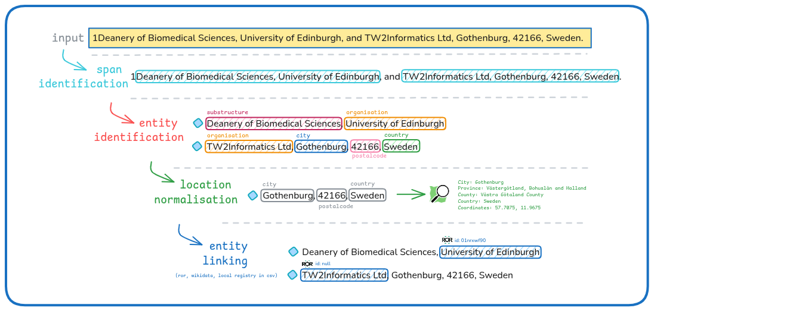

# `AffilGood` 🕺🏾

AffilGood is a Python library for **extracting and structuring research institution information** from raw affiliation strings (e.g. those found in scientific publications, project beneficiaries, or metadata dumps).

It is designed to work in **real-world, multilingual, noisy settings**, while remaining:

* 🧩 **modular**
* 🛡️ **defensive**
* 🧪 **fully testable**
* 🔌 **easy to extend**

AffilGood focuses on **stable output semantics**: regardless of which internal components are enabled, the public output schema remains consistent.



> 📄 **Publication**
> This repository accompanies the paper
> **"AffilGood: Building reliable institution name disambiguation tools to improve scientific literature analysis"**,
> published at the *Scholarly Document Processing (SDP) Workshop @ ACL 2024*.
>
> • Paper: [https://aclanthology.org/2024.sdp-1.13/](https://aclanthology.org/2024.sdp-1.13/)
> • Slides: [https://docs.google.com/presentation/d/1wX7zInjoUrjO1hRL3U8tpSzxU6KOX0FknTaEqSf6ML0](https://docs.google.com/presentation/d/1wX7zInjoUrjO1hRL3U8tpSzxU6KOX0FknTaEqSf6ML0)

---

## ✨ What `AffilGood` does

Given an affiliation string like:

```text
SELMET, Univ Montpellier, CIRAD, INRA, Montpellier SupAgro, Montpellier, France
```

AffilGood can:

* detect **institutions** (ORG), **sub-organizations** (SUBORG), and **subunits** (SUB) via NER
* **link institutions to registries** (ROR) using a three-stage cascade pipeline
* **translate non-Latin scripts** (Chinese, Japanese, Arabic, Russian, etc.) before processing
* enrich results with **geolocation** (city, country, NUTS regions, coordinates)
* **fill missing locations from ROR data** when NER misses geographic entities
* detect **language** of affiliation strings
* structure everything into a **stable, user-friendly schema**

---

## 🚀 Quick start

### Installation

```bash
git clone https://github.com/sirisacademic/affilgood.git
cd affilgood
pip install -e ".[all]"
```

> 🐍 Python ≥ 3.10 recommended

### Download data files

AffilGood requires pre-built data files (ROR registry, FAISS index, NUTS shapefiles) that are too large for the git repository. They are hosted as a GitHub Release asset.

**Automatic (recommended):**

```bash
python setup_data.py
```

**Manual:**

1. Download `affilgood-data-v2.0.0.zip` from [HuggingFace](https://huggingface.co/datasets/SIRIS-Lab/affilgood-data)
2. Extract into the repo root:

```bash
unzip affilgood-data-v2.0.0.zip -d .
```

**Verify:**

```bash
python setup_data.py  # will report ✓ for each file if already extracted
```

The data files include:

| File | Size | Description |
|---|---|---|
| `ror_records.jsonl` | ~80 MB | ROR registry (active + inactive records) |
| `faiss.index` | ~200 MB | Pre-built HNSW index (1024-dim, inner product) |
| `faiss_ids.json` | ~10 MB | Record IDs for each index vector |
| `faiss_texts.json` | ~40 MB | Indexed text variants |
| `NUTS shapefiles` | ~5 MB | EU NUTS region boundaries |

---

### Basic usage

```python
from affilgood import AffilGood

ag = AffilGood()
result = ag.process("Universitat Autònoma de Barcelona, Spain")
print(result)
```

### Recommended configuration (best accuracy)

```python
from affilgood import AffilGood

ag = AffilGood(
    enable_entity_linking=True,
    linking_config={
        "reranker": None,         # retrieval-only (Acc@1=0.905)
        "threshold": 0.5,
    },
    enable_language_detect=True,
    language_config={"method": "combined_langdetect"},
    enable_normalization=True,
    add_nuts=True,
    verbose=True,
)

result = ag.process("SELMET, Univ Montpellier, CIRAD, INRA, Montpellier SupAgro, Montpellier, France")
```

---

## 🧩 Pipeline overview

AffilGood runs a **defensive, modular pipeline** with seven stages:

```
Input → Span → Language → Translation → NER → Entity Linking → Geocoding → Output
```

| Stage | Description | Default |
|---|---|---|
| **1. Span identification** | Splits multi-affiliation strings | Always on |
| **2. Language detection** | Detects language of each span | Off (`enable_language_detect=True`) |
| **3. Translation** | Translates non-Latin scripts to English | Off (`translate_config={...}`) |
| **4. NER** | Extracts ORG, SUBORG, SUB, CITY, COUNTRY | Always on |
| **5. Entity linking** | Links ORG/SUBORG to ROR registry | On (`enable_entity_linking=True`) |
| **6. Geocoding** | Resolves locations via OSM Nominatim | Off (`enable_normalization=True`) |
| **6b. ROR→Geocode feedback** | Fills missing locations from ROR data | Automatic when both EL and geocoding are enabled |

### Design guarantees

Each stage is optional, never crashes the pipeline, never deletes previous results, and operates on a shared, well-defined internal schema.

---

## 🔗 Entity linking

Entity linking matches NER-extracted organizations against the ROR (Research Organization Registry) using a **three-stage cascade**:

### Stage 1 — Direct match

Exact name + country lookup against all ROR names, aliases, acronyms, and labels. Handles ~35% of entities at ~98% precision with zero latency.

Features:
* **Unicode-safe normalization** — "Selçuk Üniversitesi" + "TÜRKİYE" matches correctly (Turkish İ, accents)
* **Inactive record resolution** — INRA (withdrawn) automatically resolves to its successor INRAE (active)
* **Acronym support** — "CNRS" + "France" resolves directly when unambiguous

### Stage 2 — Dense retrieval

FAISS HNSW index with the `SIRIS-Lab/affilgood-dense-retriever` encoder (1024-dim XLM-RoBERTa). Queries use structured tokens matching the encoder's training format:

```
[MENTION] Univ Montpellier [CITY] Montpellier [COUNTRY] France
```

Key feature: **multi-variant queries** — each entity generates 2–4 geographic variants (ORG+CITY+COUNTRY, ORG+COUNTRY, ORG only) and results are merged by max score. This is critical for R@1=0.905.

### Stage 3 — LLM judge (optional)

For low-confidence results, a small instruction-following LLM sees all candidates simultaneously and picks the best match. Uses first-token logit scoring (one forward pass, no generation). Handles acronym confusion, same-name disambiguation, and complex affiliation chains.

### Optional: Cross-encoder reranking with score fusion

A cross-encoder reranker can be added between retrieval and final selection. Retrieval and reranker scores are fused (`alpha * retrieval + (1-alpha) * reranker`) to prevent the reranker from overriding correct retriever results.

---

## ⚙️ Configuration guide

### Minimal (NER only, no linking)

```python
ag = AffilGood()
```

### With entity linking (recommended)

```python
ag = AffilGood(
    enable_entity_linking=True,
    linking_config={
        "reranker": None,       # retrieval-only mode
        "threshold": 0.5,       # cosine similarity threshold
    },
)
```

### With geocoding and NUTS regions

```python
ag = AffilGood(
    enable_entity_linking=True,
    linking_config={
        "reranker": None,
        "threshold": 0.5,
    },
    enable_normalization=True,
    add_nuts=True,
)
```

### With language detection

```python
ag = AffilGood(
    enable_language_detect=True,
    language_config={"method": "combined_langdetect"},
    enable_entity_linking=True,
    linking_config={"reranker": None, "threshold": 0.5},
    enable_normalization=True,
    add_nuts=True,
    verbose=True,
)
```

### With non-Latin script translation

```python
ag = AffilGood(
    enable_language_detect=True,
    language_config={"method": "combined_langdetect"},
    translate_config={
        "model_name": "Qwen/Qwen2.5-0.5B-Instruct",   # ~1GB
        "device": "cpu",
    },
    enable_entity_linking=True,
    linking_config={"reranker": None, "threshold": 0.5},
    enable_normalization=True,
    verbose=True,
)

# Chinese affiliation → translated → NER → linked → geocoded
result = ag.process("清华大学计算机科学与技术系, 北京, 中国")
```

Translation auto-detects and only activates for non-Latin scripts: Chinese, Japanese, Korean, Arabic, Russian, Persian, Greek, Thai, Hindi, Ukrainian, and more.

### With cross-encoder reranking + score fusion

```python
ag = AffilGood(
    enable_entity_linking=True,
    linking_config={
        "reranker": "cross_encoder",
        "reranker_model": "cometadata/jina-reranker-v2-multilingual-affiliations-v5",
        "score_fusion_alpha": 0.5,   # 0=reranker only, 1=retriever only
        "threshold": 0.5,
    },
)
```

### With LLM judge for hard cases

```python
ag = AffilGood(
    enable_entity_linking=True,
    linking_config={
        "reranker": None,
        "threshold": 0.5,
        "llm_judge": "Qwen/Qwen2.5-0.5B-Instruct",   # ~1GB, or 3B for better accuracy
        "llm_threshold": 0.7,   # invoke LLM when retrieval score < 0.7
    },
)
```

### Full configuration (all features)

```python

ag = AffilGood(
    enable_entity_linking=True,
    device="cpu",
    linking_config={
        "data_dir": str(data_dir),
        "encoder_model": "SIRIS-Lab/affilgood-dense-retriever",
        "threshold": 0.038,
        "reranker": "cross_encoder",
        "reranker_model": "cometadata/jina-reranker-v2-multilingual-affiliations-large",
        "reranker_threshold": 0.038,
        "llm_judge": "Qwen/Qwen2.5-1.5B-Instruct",
        "llm_threshold": 0.3,
    },
    enable_language_detect=True,
    language_config={"method": "combined_langdetect"},
    verbose=True,
    enable_normalization=True,
    add_nuts=True,
)
```

### Custom data directory (pre-built index)

```python
linking_config={
    "data_dir": "/path/to/entity_linking/data",
    ...
}
```

---

## 📤 Output schema

### Normalized output (default)

```python
result = ag.process("SELMET, Univ Montpellier, CIRAD, INRA, Montpellier SupAgro, Montpellier, France")
```

```json
{
  "raw_text": "SELMET, Univ Montpellier, CIRAD, INRA, Montpellier SupAgro, Montpellier, France",
  "outputs": [
    {
      "input": "SELMET, Univ Montpellier, CIRAD, INRA, Montpellier SupAgro, Montpellier, France",
      "institutions": [
        {
          "name": "Université de Montpellier",
          "query": "Univ Montpellier",
          "id": {
            "ror_id": "https://ror.org/051escj72",
            "ror_name": "Université de Montpellier",
            "ror_country": "France",
            "ror_country_code": "FR",
            "ror_city": "Montpellier",
            "ror_types": ["education"]
          },
          "confidence": 0.97,
          "source": "ror"
        },
        {
          "name": "Centre de Coopération Internationale en Recherche Agronomique pour le Développement",
          "query": "CIRAD",
          "id": {"ror_id": "https://ror.org/05kpkpg04", "...": "..."},
          "confidence": 1.0,
          "source": "ror"
        }
      ],
      "subunits": [
        {
          "name": "Systèmes d'élevage méditerranéens et tropicaux",
          "id": {"ror_id": "https://ror.org/05merjr74", "...": "..."},
          "confidence": 1.0,
          "source": "ror"
        }
      ],
      "location": {
        "city": "Montpellier",
        "county": "Hérault",
        "region": "Occitania",
        "country": "France",
        "country_code": "FRA",
        "continent": "Europe",
        "un_region": "Western Europe",
        "lat": 43.611,
        "lon": 3.877,
        "nuts": {
          "nuts0_id": "FR",
          "nuts1_id": "FRJ",
          "nuts2_id": "FRJ1",
          "nuts3_id": "FRJ13",
          "nuts3_name": "Hérault"
        },
        "source": {"city": "osm", "country": "osm"}
      },
      "language": "fr",
      "confidence": 0.97
    }
  ]
}
```

### Entity types

| NER type | Output section | Linked to ROR? |
|---|---|---|
| **ORG** | `institutions` | Yes |
| **SUBORG** | `subunits` | Yes (sub-organizations with own registry entry) |
| **SUB** | `subunits` | No (departments, labs — pass-through) |

### Location sources

| Source tag | Meaning |
|---|---|
| `"osm"` | Geocoded from NER-extracted city/country via OSM Nominatim |
| `"ror-osm"` | Geocoded from ROR city/country when NER missed location |
| `"ner"` | Taken directly from NER (address, postal code) |

### Debug output

```python
result = ag.process("...", return_debug=True)
```

Returns the full internal pipeline state including raw NER scores, all entity linking candidates, and intermediate results.

---

## 🏗️ Building the FAISS index

The dense retriever requires a pre-built FAISS index. On first use it builds automatically (slow on CPU). For faster builds, use GPU:

```python
from affilgood.components.entity_linking.registry import RegistryManager
from affilgood.components.entity_linking.index import IndexBuilder
from pathlib import Path

data_dir = Path("affilgood/components/entity_linking/data")

registry = RegistryManager(data_dir=data_dir, verbose=True)
records = registry.get_records("ror", active_only=False)

builder = IndexBuilder(
    data_dir=data_dir / "ror",
    encoder_model="SIRIS-Lab/affilgood-dense-retriever",
    device="cuda",       # GPU: ~2-3 min; CPU: ~30-45 min
    batch_size=512,
    verbose=True,
)

index = builder.build_dense_index(records, index_type="hnsw", rebuild=True)
```

The index is cached to `data/ror/dense/` and loaded automatically on subsequent runs. Rebuild when: ROR dump is updated, encoder model changes, or you pass `rebuild_index=True`.

---

## 🏗️ Project structure

```text
affilgood/
├── api.py                        # Public API (AffilGood)
├── pipeline.py                   # Pipeline orchestration
├── output.py                     # Output normalization
├── components/
│   ├── span.py                   # Span identification
│   ├── ner.py                    # Named Entity Recognition
│   ├── language.py               # Language detection
│   ├── translate.py              # Non-Latin script translation
│   ├── geocode.py                # OSM Nominatim geocoding
│   └── entity_linking/
│       ├── linker.py             # Cascade orchestrator
│       ├── registry.py           # ROR data management
│       ├── index.py              # FAISS index building
│       ├── retrievers/
│       │   ├── base.py           # BaseRetriever ABC
│       │   └── dense.py          # FAISS dense retriever
│       └── rerankers/
│           ├── base.py           # BaseReranker ABC
│           ├── cross_encoder.py  # Cross-encoder reranker
│           └── llm.py            # LLM listwise reranker
```

> 📌 Users should only import `AffilGood` from the top-level package.
> Internal components are not part of the public API.

---

## 📊 Performance

Benchmarked on 4,006 test affiliations across 12 datasets:

| Configuration | Acc@1 | Notes |
|---|---|---|
| Dense retrieval only | 0.905 | `reranker=None` |
| + cross-encoder (jina_comet) | 0.911 | Best overall |
| + score fusion (α=0.35) | ~0.93 | Prevents reranker degradation |
| Direct match baseline | 0.981 precision | ~35% coverage |
| Cascade (DM → retrieval) | Best of both | Default mode |

See `docs/error_analysis.md` for detailed analysis of error patterns and improvement strategies.

---

## 🧪 Running tests

```bash
pytest
```

```text
tests/
├── components/   # Unit tests for individual components
├── pipeline/     # Pipeline wiring and invariants
├── output/       # Public output schema contract tests
├── test_smoke.py # End-to-end API sanity checks
```

---

## 📝 Citation

If you use AffilGood in your research, please cite:

```bibtex
@inproceedings{duran-silva-etal-2024-affilgood,
    title = "{A}ffil{G}ood: Building reliable institution name disambiguation tools to improve scientific literature analysis",
    author = "Duran-Silva, Nicolau  and
      Accuosto, Pablo  and
      Przyby{\l}a, Piotr  and
      Saggion, Horacio",
    booktitle = "Proceedings of the Fourth Workshop on Scholarly Document Processing (SDP 2024)",
    year = "2024",
    url = "https://aclanthology.org/2024.sdp-1.13",
}
```

---

## 🙋‍♀️ Contributing

We welcome contributions! We use two branches:

* `develop` — default branch for development
* `main` — production branch for deployed services

Please see [`docs/contribution-guide.md`](docs/contribution-guide.md).

---

## 📫 Contact

📧 [nicolau.duransilva@sirisacademic.com](mailto:nicolau.duransilva@sirisacademic.com)

---

## ⚖️ License

Licensed under the **Apache License, Version 2.0**
[https://www.apache.org/licenses/LICENSE-2.0](https://www.apache.org/licenses/LICENSE-2.0)
